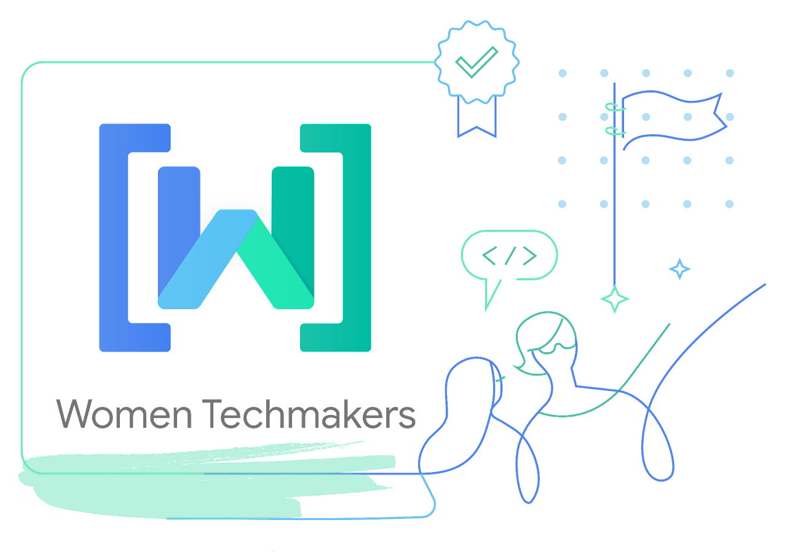

# Code of Conduct | WTM UFG

Women Techmakers (WTM) is a global program led by Google aimed at empowering and supporting women in the technology field. Founded in 2012, WTM offers a variety of initiatives and resources to promote gender equality and diversity in the technology sector. This includes events, workshops, scholarships, mentoring, and networking for women interested in careers in STEM (Science, Technology, Engineering, and Mathematics). The main goal of Women Techmakers is to create an inclusive and supportive community that empowers and celebrates the achievements of women in the technology industry while working to overcome the barriers and challenges they face.

You can learn more about our activities at: [WTM UFG Community](https://gdg.community.dev/gdg-goiania/)

## Code of Conduct
We believe in an environment where everyone feels welcome and can share their challenges, issues, and opinions so the community can assist in the growth of all. The Code of Conduct is a guide to behavior for all environments within our community.

### 🔒 WTM UFG should be a safe and inviting place for individuals regardless of:

- Gender, gender identity, or gender expression;
- Sexual orientation;
- Physical abilities;
- Physical appearance (including, but not limited to, body size);
- Race and/or ethnicity;
- Age;
- Religion or lack thereof;
- Choice of technologies.

### ✔️ As a member of this group, you agree that:

- We are collectively and individually committed to safety and inclusion;
- We adopt a zero-tolerance policy for harassment, persecution, or discrimination;
- We respect the boundaries, identity, and privacy of individuals;
- We refrain from using language that may be considered oppressive, such as sexist, racist, homophobic, transphobic, classist, or discriminatory comments towards people with any type of disability, but this Code of Conduct is not limited to just these;
- We avoid offensive topics as a form of humor;
- We avoid topics that are outside the scope of the group, such as political content.
- We avoid subjects related to sex.

### ✔️ We actively work to:

- Be a safe community;
- Cultivate a network of support and encouragement for all;
- Encourage varied forms of expression responsibly.

### ❌ We DO NOT allow:

- Creating a profile pretending to be someone else for entertainment purposes, fraud, or encouraging violations of the code of conduct (i.e. impersonation);
- Harassment, doxxing (investigating a person's life without permission), or improper publication of private information;
- Threats and harassment of any kind;
- Any behavior that compromises the safety of other members.

### ✔️ If you say something that is considered offensive and are called out, it's important to:

- Listen without interrupting;
- Believe what the person is saying and not try to discredit what they have to say;
- Ask for tips or help to avoid future offenses;
- Understand your mistake and know how to apologize.

### ❓ What if the Code of Conduct is violated?

**Online:**

If you experience any form of abuse, harassment, discrimination, or feel unsafe, please contact Wendel Marques (WTM UFG Lead). If the Lead is the person you want to report, please contact Amanda Mazini (Community Manager, Brazil) or Rodrigo Akira (Regional Leader, Brazil).

**In-Person Events:**

If someone engages in harassing behavior, the organizing team may take any action they deem appropriate, including warning the offending person or expelling them from the conference and/or groups, with the facts established. In the case of paid events, there will be no refund.

Disregarding the rules of this community, as described in this document, will result in consequences:
- Depending on the type of infraction committed, the message history of communication tools or recordings of the event/meeting may be used as evidence in a formal process;
- The member may be removed from the Core Team or public group of the community.

**Google Events Community Guidelines**
- Available at: [Google Events Community Guidelines](https://www.google.com/events/policy/anti-harassmentpolicy.html)

### Suggestions and Improvements
This Code of Conduct is a living document that guides our group to be better and larger. Therefore, we are open to comments and adjustments that can be proposed through Pull Requests or Issues.

---

Code of Conduct based on:
- [AndroidDevBR/Codigo-De-Conduta](https://github.com/AndroidDevBR/Codigo-De-Conduta)
- [PERIFACODE](https://perifacode.com/COC/)
- [WoMakersCode](https://maismulheres.tech/p/terms)
